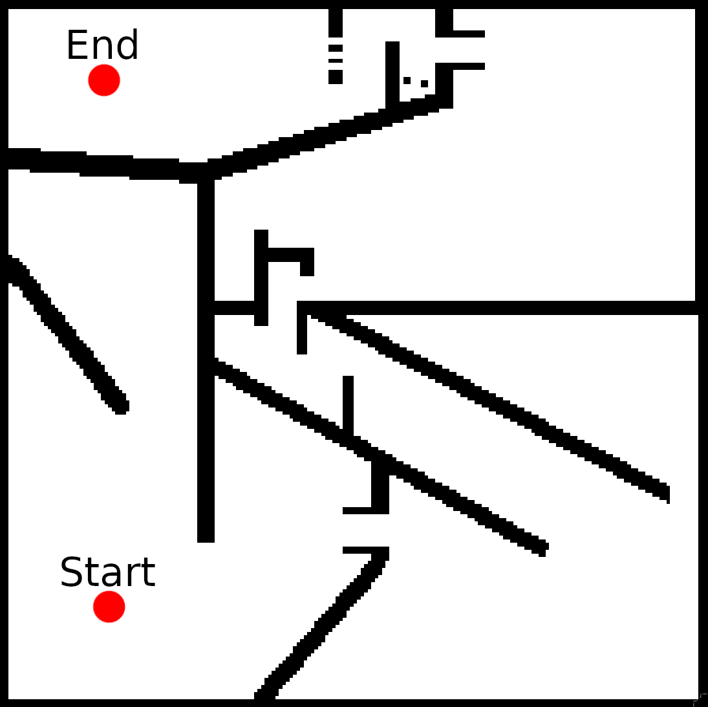

# Maze environment for MAP Elites
This repo implements the MAP-Elites (https://arxiv.org/abs/1504.04909) evolutionary algorithm applied to a maze environment, where a small robot has to navigate a complex maze. The maze is shown below:

## Typical results
The typical results are shown below for how MAP-Elites is able to explore the maze (the number to the right in the title represents the evolutionary generation):
